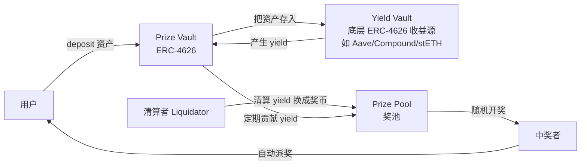
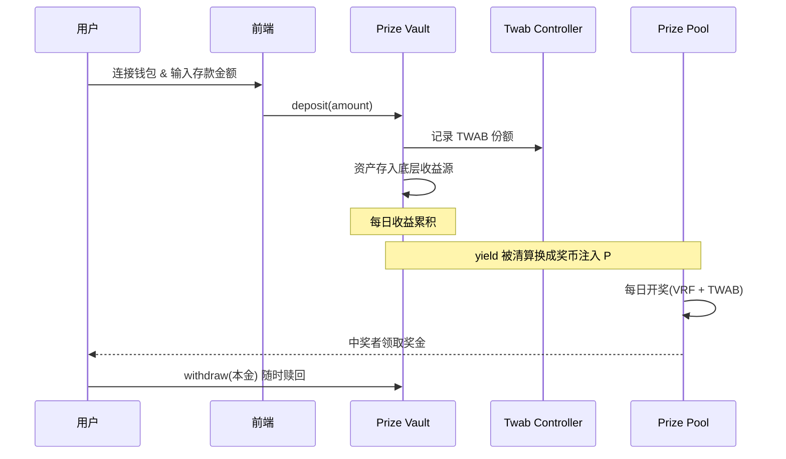
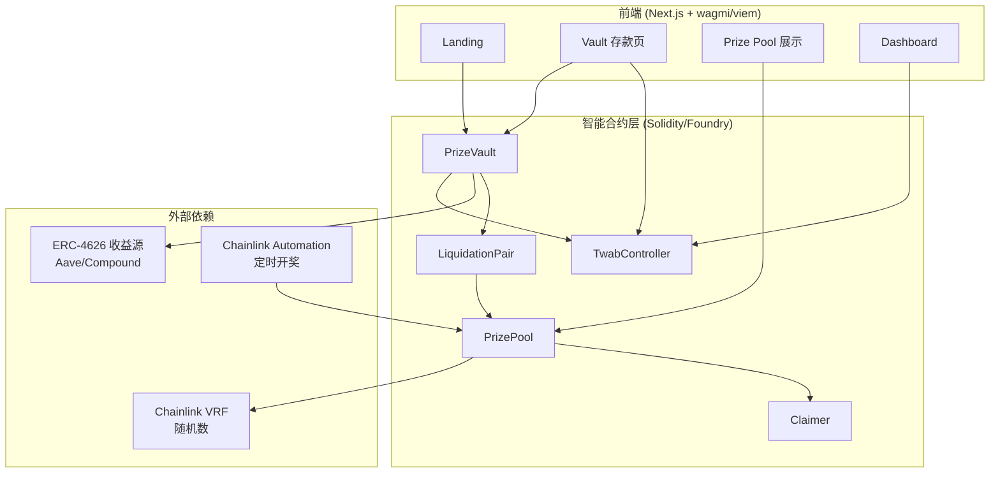

# 去中心化储蓄抽奖应用（Prize Savings）设计文档

> 仿写对象：PoolTogether（前端入口 `pooly.eth.limo` / `pooltogether.com`）
> 文档性质：从调研 → 需求 → 架构 → 合约 → 前端 → 安全 → 落地路线图的完整方案
> 版本：v0.1（2026-09-27）

---

## 目录

1. [背景与调研结论](#1-背景与调研结论)
2. [PoolTogether 机制深度解析](#2-pooltogether-机制深度解析)
3. [仿写目标与差异化定位](#3-仿写目标与差异化定位)
4. [需求分析](#4-需求分析)
5. [产品设计](#5-产品设计)
6. [整体技术架构](#6-整体技术架构)
7. [智能合约设计](#7-智能合约设计)
8. [中奖算法与公平性设计](#8-中奖算法与公平性设计)
9. [前端设计](#9-前端设计)
10. [安全、审计与合规](#10-安全审计与合规)
11. [落地路线图与里程碑](#11-落地路线图与里程碑)
12. [测试与部署方案](#12-测试与部署方案)
13. [附录：参考资源与术语表](#13-附录参考资源与术语表)

---

## 1. 背景与调研结论

### 1.1 什么是"储蓄抽奖"（Prize Savings / No-Loss Lottery）

储蓄抽奖是一种金融产品形态：用户本金**永不损失**，所有存款产生的**收益（利息）**被汇聚成一个奖金池，通过随机抽奖的方式发放给部分存款人。

与传统彩票的关键区别：

| 维度 | 传统彩票 | 储蓄抽奖（Prize Savings） |
|------|----------|---------------------------|
| 本金 | 购买即沉没 | 100% 可随时赎回 |
| 资金来源 | 用户购彩款 | 存款的利息/收益 |
| 参与者期望 | 大概率亏损 | 至少不亏，可能中奖 |
| 监管属性 | 博彩 | 储蓄产品（多地被认定非彩票） |

### 1.2 PoolTogether 调研要点

PoolTogether 是该赛道的开创者与标杆，自 2019 年上线至今（历经 V1→V5），累计分发奖金超 **1000 万美元**，钱包用户超 **10 万**，历史上**从未发生过用户本金损失**。

V5（2024 年发布）是其最新一代，核心定位从"一个产品"演进为"一个**无许可的超级结构（Hyperstructure）**"：

- **无许可**：任何人都可创建新的 Prize Vault（接入任意 ERC-4626 收益源），无需审批。
- **自主运行**：核心合约不可变、无管理员、无治理参数可调。
- **自动化**：开奖、派奖、清算等"维护"动作全部由**激励式拍卖 + 机器人**驱动，无中心化控制点。
- **多资产共享奖池**：所有资产共享同一个大奖池，使单个奖金池尽可能大。

### 1.3 关键结论（对仿写者的启示）

1. **核心壁垒在合约而非前端**：产品价值集中在 `PrizePool` / `TwabController` / `PrizeVault` 三个合约的正确性与公平性上。
2. **公平性的灵魂是 TWAB**（时间加权平均余额），用于防止"开奖前秒入秒出"的套利攻击。
3. **收益来源规范化靠 ERC-4626**：V5 通过把"收益金库"标准化为 ERC-4626，实现了收益源的可插拔与无许可扩展。
4. **去中心化开奖是难点**：V5 用"抛物线分数荷兰式拍卖（PFDA）"激励第三方机器人完成 RNG 请求与开奖结算。
5. **技术栈成熟且开源**：合约用 Foundry + Solidity，前端用 Next.js + wagmi + viem + Tailwind；可大量复用 `OpenZeppelin` 与 `generationsoftware` 的开源实现。

---

## 2. PoolTogether 机制深度解析

### 2.1 资金流全景



### 2.2 三大核心阶段

1. **存款（Deposit）**：用户把资产存入 Prize Vault，Vault 把份额记录在 TwabController 中，并把底层资产投入 Yield Vault 赚取收益。
2. **清算（Liquidation）**：收益累积到一定阈值后，清算者把 yield 换成"奖币（prize token）"注入 Prize Pool，赚取清算价差作为激励。
3. **派奖（Prize Distribution）**：每日开奖，按随机数与用户 TWAB 决定中奖者，奖金自动转入用户钱包（V5 无需手动 claim）。

### 2.3 核心机制拆解

#### （1）TWAB Controller —— 公平性的基石

TWAB = **Time-Weighted Average Balance（时间加权平均余额）**。

- **解决什么问题**：防止用户在开奖前瞬间大额存款、开奖后立即取出的套利（"闪电存款攻击"）。
- **工作原理**：每次余额变动记录一个 `Observation`（含时间戳、变动后余额、累计余额），存入环形缓冲区（最长回溯 1 年）。
- **中奖资格**：以用户在开奖周期内的**平均余额**（而非某一时点余额）作为中奖概率权重，灵感来自 Uniswap TWAP。
- **委托机制**：区分 `owned balance`（本人持有）与 `delegated balance`（被委托余额），支持治理性委托与团队账户汇总。

#### （2）Prize Vault —— ERC-4626 收益金库

- 用户存入资产，Vault 内部赚取收益并把"份额（share）"记入 TwabController（Vault 自身不存余额）。
- 实现"**零损失到最后一 wei**"的两个策略：
  - **尘埃收集策略（dust collection）**：主动控制底层 vault 的 share 铸造精度，把舍入误差压到每笔 1 wei。
  - **收益缓冲（yield buffer）**：预留一小部分收益，用于吸收存取款时的舍入误差，防止总资产 < 总供给。
- 支持**自定义 Hook**（在领奖前后调用），以及**领取人（Claimer）合约**代用户领奖。

#### （3）Prize Pool —— 奖池与开奖

- 持有奖金流动性，负责每日开奖、按随机数分发奖金。
- 支持**分级奖金结构**：大奖（Grand Prize）、次级奖（Tier 2）、金丝雀奖（Canary Prize，大量小额），高频小额奖用于维持用户活跃度。
- 每条链一个 Prize Pool（"孤岛"模型，链间奖金不共享）。

#### （4）Draw Auction —— PFDA（抛物线分数荷兰式拍卖）

用于**去中心化地**完成开奖所需的两个动作：

1. **Start RNG**：激励某人向随机源（Witnet / Chainlink VRF）发起随机数请求。
2. **Finish RNG**：随机数就绪后，激励某人用它完成开奖结算。

奖励从奖池的**储备金（reserve）**中支付，采用**抛物线分数荷兰式拍卖（PFDA）**定价函数，在目标时间 `T` 缓慢到达目标价格 `P`，避免线性拍卖在储备金较大时对机器人过度支付。

### 2.4 技术栈（官方开源实现）

| 层 | 技术 | 说明 |
|----|------|------|
| 智能合约 | Solidity + Foundry | `pt-v5-*` 系列仓库 |
| 前端应用 | Next.js + TypeScript + Tailwind | `pooltogether-client-monorepo`（Turborepo + pnpm） |
| Web3 交互 | wagmi + viem + RainbowKit | ABI 级类型安全 |
| 轻量前端 | SvelteKit + viem | `pt-classic` 极简界面（零第三方 API） |
| 随机源 | Chainlink VRF / Witnet | 可证明公平的链上随机数 |
| 收益源 | ERC-4626（Aave、Compound、Lido stETH 等） | 可插拔 |

---

## 3. 仿写目标与差异化定位

### 3.1 仿写范围

以 MVP 为目标，做一条**可运行的储蓄抽奖应用**，覆盖完整闭环：

存款 → 赚取收益 → 清算注入奖池 → 每日开奖 → 派奖 → 随时赎回本金。

### 3.2 与 PoolTogether 的差异点（可选，用于产品定位）

| 维度 | PoolTogether V5 | 我们的 MVP 方案 |
|------|-----------------|-----------------|
| 协议治理 | 无治理超结构，任何人可建 vault | 先做**白名单 vault + 管理员可升级**，降低复杂度 |
| 开奖去中心化 | PFDA 拍卖 + 第三方机器人 | MVP 先用 **Chainlink Automation + VRF** 半自动开奖，后续再演进到拍卖 |
| 奖币 | 单一奖币（如 WETH/POOL） | M0 支持单一 ERC-20 奖币，统一简单 |
| 多资产 | 多资产共享奖池 | MVP 单资产（USDC）起步，验证闭环后再扩展 |
| 领取方式 | 自动派奖 + 代领者 | 先支持"开奖后主动 claim"，降低合约复杂度 |

> 差异化策略建议：**先做"窄而深"**——单链、单资产、单一奖币，把公平性与安全性做到位，再逐步"宽而广"。

---

## 4. 需求分析

### 4.1 目标用户与使用场景

- **储蓄型用户**：想把稳定币"存起来"，同时获得中奖的正向激励。
- **DeFi 收益型用户**：希望本金安全，愿意用利息换取中大奖机会。
- **普通散户**：被"零损失抽奖"概念吸引，低门槛参与。

### 4.2 功能需求（Functional Requirements）

| 编号 | 功能 | 优先级 | 说明 |
|------|------|--------|------|
| FR-1 | 钱包连接 | P0 | 支持 MetaMask/WalletConnect 等 |
| FR-2 | 存款 | P0 | 存入 USDC，铸造 prize share 份额 |
| FR-3 | 赎回 | P0 | 随时赎回，本金无损（本金部分） |
| FR-4 | 收益清理入池 | P0 | yield 定期转换成奖币注入奖池 |
| FR-5 | 每日开奖 | P0 | 基于 VRF 随机数，按 TWAB 权重抽奖 |
| FR-6 | 中奖查询与领取 | P0 | 用户查看中奖结果并领取奖金 |
| FR-7 | 奖池/历史开奖展示 | P1 | 展示奖池规模、历史中奖记录 |
| FR-8 | 中奖概率预估 | P1 | 展示用户当前 TWAB 对应的中奖概率 |
| FR-9 | 委托 | P2 | TWAB 委托（团队/治理场景） |
| FR-10 | 多 Vault/多资产 | P2 | 扩展多资产共享奖池 |

### 4.3 非功能需求（Non-Functional Requirements）

| 编号 | 需求 | 说明 |
|------|------|------|
| NFR-1 | 安全性 | 合约需通过审计，无权限漏洞，本金不可冻结 |
| NFR-2 | 公平性 | 中奖概率严格正比于 TWAB，抗闪电存款攻击 |
| NFR-3 | 去中心化 | 开奖不依赖单一中心化服务器 |
| NFR-4 | 可扩展性 | 收益源可插拔，architecture 支持多链 |
| NFR-5 | 可用性 | 前端响应快，gas 优化，操作流畅 |
| NFR-6 | 合规性 | 定位为储蓄产品，非博彩，需披露风险 |

### 4.4 核心用户故事

- "作为用户，我想存入 USDC，这样就能参与抽奖且本金随时可赎。"
- "作为用户，我想看到我的中奖概率随存款时长变化，这样我能理解公平性。"
- "作为用户，我中奖后希望能自动/便捷地领取奖金。"
- "作为清算者/机器人，我想清算收益并从中获利，这样协议能无人值守持续运行。"

---

## 5. 产品设计

### 5.1 核心页面

1. **首页/Landing**：产品价值主张（"存钱 + 抽奖 + 零损失"）、实时奖池总额、下一期开奖倒计时。
2. **存款页（Vault）**：展示 APY、我的余额、存款/赎回表单、中奖概率。
3. **奖池页（Prize Pool）**：当前奖池、奖金分级结构、历史中奖记录（Winner List）。
4. **我的账户（Dashboard）**：我的存款、累计中奖记录、TWAB 曲线。
5. **开奖详情**：单次 draw 的随机数、中奖者、奖金分配。

### 5.2 用户核心流程



### 5.3 MVP 与后续版本范围

- **MVP（M0）**：单链（如 Base/Optimism 测试网主网二者任一）、单资产 USDC、单一奖币、开奖=VRF+手动/自动化 claim。
- **V1（M1）**：自动派奖、Claimer、多资产、白名单多 vault。
- **V2（M2）**：无许可 vault factory、PFDA 去中心化开奖、多链。

---

## 6. 整体技术架构

### 6.1 架构总览



### 6.2 仓库结构建议

```
prize-savings/
├── contracts/               # Foundry 合约 (src/, test/, script/)
├── frontend/                # Next.js 应用
├── subgraph/                # The Graph 索引（中奖历史、TWAB 聚合）
├── keeper/                  # 清算 & 开奖机器人（可选）
└── packages/                # 共享 SDK（viem 合约封装、hooks）
```

---

## 7. 智能合约设计

### 7.1 核心合约清单

| 合约 | 职责 | 参考（PoolTogether） |
|------|------|---------------------|
| `TwabController.sol` | 记录用户时间加权平均余额 | `pt-v5-twab-controller` |
| `PrizeVault.sol` | ERC-4626 金库，接入收益源，贡献 yield | `pt-v5-vault` |
| `PrizePool.sol` | 奖池、开奖、派奖、奖金分级 | `pt-v5-prize-pool` |
| `LiquidationPair.sol` | 清算 yield 换奖币 | `pt-v5-liquidator` |
| `Claimer.sol` | 代用户领取奖金（可选） | `pt-v5-claimer` |
| `PrizeVaultFactory.sol` | 一键部署新 vault（可选，M2） | `pt-v5-vault` |
| `RngRelayAuction.sol` | PFDA 去中心化开奖（可选，M2） | `pt-v5-draw-auction` |

### 7.2 关键合约接口（精简）

#### `PrizeVault`（继承 ERC-4626 + TwabERC20 + Ownable）

```solidity
interface IPrizeVault is IERC4626 {
    // 存入资产，为用户铸造份额并记录 TWAB
    function deposit(uint256 assets, address receiver) external returns (uint256 shares);
    // 赎回
    function withdraw(uint256 assets, address receiver, address owner) external returns (uint256 shares);
    // 把可清算的 yield 暴露给清算者
    function liquidatableBalanceOf(address tokenOut) external view returns (uint256);
    // 清算后把奖币贡献给 PrizePool
    function contributePrizeTokens(address prizePool, uint256 amount) external;
    // 校验：claimPrize 后可赎回
    function claimPrize(...) external;
}
```

#### `TwabController`

```solidity
interface ITwabController {
    function mint(address to, uint256 amount) external;
    function burn(address from, uint256 amount) external;
    // 查询某时间点余额（用于开奖）
    function getBalanceAt(address user, uint32 timestamp) external view returns (uint256);
    // 查询某区间 TWAB
    function getTwabBetween(address user, uint32 start, uint32 end) external view returns (uint256);
    // 委托
    function delegate(address to) external;
}
```

#### `PrizePool`

```solidity
interface IPrizePool {
    // 奖池配置
    function prizeToken() external view returns (address);
    function drawPeriodSeconds() external view returns (uint32);
    // 开奖
    function awardDraw(uint256 winningRandomNumber) external returns (uint32 drawId);
    // 领取奖金
    function claimPrize(address winner, uint8 tier, uint32 drawId) external returns (uint256);
    // 贡献奖币
    function contributePrizeTokens(address vault, uint256 amount) external returns (uint256);
}
```

### 7.3 状态机与关键不变量（Invariants）

- **零损失不变量**：`PrizeVault.totalAssets() >= totalSupply()` 始终成立（yield buffer 兜底吸收舍入误差）。
- **份额守恒**：`TwabController` 中所有用户份额之和 == `PrizeVault.totalSupply()`。
- **TWAB 只读追溯**：开奖使用"开奖周期的历史 TWAB"，开奖后余额变动不影响已开奖结果。

### 7.4 收益清算设计（Liquidation）

- `LiquidationPair` 提供一个随时间线性降价的"清算价"（以奖币定价）。
- 清算者可用奖币按当前清算价"买走" vault 中累积的 yield，实现 yield → 奖币的转换。
- 奖币随后被 `contributePrizeTokens` 注入 Prize Pool，形成下一期奖金。

---

## 8. 中奖算法与公平性设计

### 8.1 中奖概率模型

- 单用户中奖概率 `P_i = TWAB_i / Σ TWAB`（在开奖周期内）。
- 用 VRF 提供的**可证明随机数**作为种子，对"份额空间"进行抽样，命中哪个用户的 TWAB 区间，该用户即中奖。

### 8.2 分级奖金（Tiered Prize）

| 档位 | 数量 | 奖金额度 | 作用 |
|------|------|----------|------|
| Grand Prize | 1 | 当期大部分 yield | 制造"大奖"吸引力 |
| Tier 2 | 若干 | 中等 | 中奖频次 |
| Canary Prize | 大量 | 小额（< $1） | 高频正反馈、验证开奖正确性 |

### 8.3 公平性保障清单

1. **TWAB 时间加权**：闪存存款对中奖概率几乎无贡献。
2. **开奖后不可篡改**：随机数一旦提交，历史 draw 立即固化。
3. **链上随机源**：使用 Chainlink VRF（可验证随机数），杜绝中心化作弊。
4. **观察期对齐**：Twab 的观察周期需**小于等于**开奖周期，且与开奖边界对齐，防止期末余额操纵。

---

## 9. 前端设计

### 9.1 技术选型

- 框架：Next.js（App Router）
- 语言：TypeScript
- 样式：Tailwind CSS
- Web3：wagmi + viem + RainbowKit
- 数据索引：The Graph subgraph（中奖历史、聚合 TWAB）
- 图表：Recharts（TWAB 曲线、中奖历史）

### 9.2 主要 Hook 与状态

| Hook | 职责 |
|------|------|
| `useUserBalance` | 查询用户份额 |
| `useTwab` | 查询当前 TWAB 与中奖概率 |
| `usePrizePool` | 查询奖池总额、下一期倒计时 |
| `useWinners` | 查询历史中奖记录 |
| `useDeposit/useWithdraw` | 存款/赎回交易封装 |

### 9.3 关键交互细节

- 存款/赎回走 `writeContract`，展示 gas 估算与交易状态。
- 中奖结果查询走 subgraph（跨区块高效聚合中奖记录）。
- 用 `multicall` 批量读取（余额、TWAB、奖池）减少 RPC 调用。

---

## 10. 安全、审计与合规

### 10.1 安全清单

- **合约审计**：委托第三方（如 Code4rena 竞赛、0xMacro、Sherlock）审计核心合约。
- **形式化不变量测试**：用 Foundry 的 invariant test 验证"零损失"、"份额守恒"。
- **Fork 测试**：在真实主网 fork 上集成测试 Aave/Compound 收益源。
- **权限最小化**：MVP 阶段保留 owner 角色但不拥有资金 OP 权限；资金始终由合约与用户控制。
- **Bug Bounty**：上线后设置漏洞赏金。

### 10.2 已知风险与缓解

| 风险 | 缓解 |
|------|------|
| 收益源（Aave 等）被黑 | 仅接入成熟、已审计的 ERC-4626 vault；分散收益源 |
| VRF 费用/故障 | 设置 fallback 随机源；开奖失败可重试 |
| 闪电贷款攻击 | TWAB 时间加权 + 余额快照开奖 |
| 舍入误差攻击 | 尘埃收集 + yield buffer |
| 智能合约漏洞 | 多轮审计 + 不变量测试 + 白帽赏金 |

### 10.3 合规定位

- 明确定位为**储蓄产品**而非博彩（奖金来自存款收益，本金不损失）。
- 上线前在法务层面确认目标司法辖区（PoolTogether 已在瑞士、英国等地被认定为非托管、合规储蓄）。
- 前端做**风险披露**（利率风险、智能合约风险、收益源风险）。

---

## 11. 落地路线图与里程碑

| 里程碑 | 内容 | 交付物 |
|--------|------|--------|
| M0 合约 MVP | TwabController + PrizeVault + PrizePool + LiquidationPair，走完完整闭环 | Foundry 合约 + 单测 |
| M0 前端 MVP | 存款/赎回/开奖展示/领取，连接测试网 | Next.js 前端 |
| M0 集成 | 接入真实 ERC-4626 收益源 + VRF | 测试网运行 |
| M1 审计 | 第三方审计 + fork 测试 + 不变量测试 | 审计报告 |
| M1 上线 | 部署主网（单链单资产）+ bug bounty | 主网运行 |
| M2 扩展 | 多资产、多 vault、自动派奖、Claimer | 扩展版 |
| M3 去中心化 | 无许可 vault factory + PFDA 去中心化开奖 | 超结构版 |

---

## 12. 测试与部署方案

### 12.1 测试策略

- **单元测试**：每个合约核心函数（Foundry tests）。
- **不变量测试**：零损失、份额守恒、TWAB 追溯正确性。
- **Fork 集成测试**：在以太坊/Base 主网 fork 上测试真实 ERC-4626 收益源。
- **端到端测试**：前端 → 合约 → subgraph 全链路。
- **开奖模拟**：用本地 VRF mock 验证中奖概率分布。

### 12.2 部署清单

1. 部署 `TwabController`
2. 部署 `PrizePool`（配置奖币、开奖周期）
3. 部署 `PrizeVault`（绑定 TwabController、PrizePool、底层 ERC-4626）
4. 部署 `LiquidationPair`
5. 配置 Chainlink VRF 订阅
6. 部署前端 + subgraph

### 12.3 部署脚本（Foundry 示例骨架）

```solidity
// script/Deploy.sol
contract Deploy {
    function run() external {
        vm.startBroadcast();
        TwabController twab = new TwabController(periodLength, periodOffset);
        PrizePool pool = new PrizePool(prizeToken, drawPeriodSeconds, ...);
        PrizeVault vault = new PrizeVault(name, symbol, yieldVault, pool, claimer, ...);
        // 配置清算与授权...
        vm.stopBroadcast();
    }
}
```

---

## 13. 附录：参考资源与术语表

### 13.1 参考资源

- PoolTogether 官网：https://pooltogether.com/
- V5 协议设计文档：https://v4.docs.pooltogether.com/protocol/design/
- V5 开发者文档：https://dev.pooltogether.com/
- 合约源码（Generation Software）：
  - Prize Vault：https://github.com/generationsoftware/pt-v5-vault
  - 前端 monorepo：https://github.com/GenerationSoftware/pooltogether-client-monorepo
- 审计报告：https://docs.pooltogether.com/security/audits
- 标准：ERC-4626（收益金库标准）、Chainlink VRF（可验证随机数）

### 13.2 术语表

| 术语 | 释义 |
|------|------|
| Prize Savings | 奖金储蓄/无损抽奖，奖金来自存款收益 |
| No-Loss | 零损失，本金可随时全额赎回 |
| TWAB | 时间加权平均余额 |
| Prize Vault | 接入收益源、贡献 yield 的 ERC-4626 金库 |
| Prize Pool | 汇聚奖金、负责开奖与派奖的合约 |
| Yield Vault | 底层 ERC-4626 收益源（Aave/Compound 等） |
| Liquidation Pair | yield 换奖币的清算机制 |
| PFDA | 抛物线分数荷兰式拍卖（开奖激励） |
| VRF | 可验证随机函数（Chainlink） |
| Claimer | 代用户领取奖金的合约 |
| Draw | 一次开奖（通常每日一次） |
| Hyperstructure | 无许可、不可变、可无限运行的协议结构 |